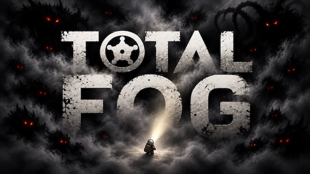

# Total Fog



**You only know what your colonists can see.**

Total Fog adds real fog of war to RimWorld. The map is dark until someone looks at it.
When your colonists walk away, the area goes grey again, and you no longer know
what happens there. A raid can come out of the dark. A sound in the night may be
a wild boar or something much worse. To be safe, you have to look.

> **Early version for RimWorld 1.6.** Testing is still going on. Feedback, bug
> reports and saves that show problems are very welcome:
> [issues](https://github.com/pardeike/TotalFog/issues).

## What you get

### See only what your people see
- Colonists, trained animals and turrets each see a circle around them. Walls block their view.
  Trees can block it too, if you want.
- Areas you explored stay on the map, but they are grey. You see the ground, not
  who walks on it right now.
- Allies, neutral visitors and even prisoners can share their view with you
  (each one is a setting).

### Build your own eyes
- Surveillance cameras: on posts, on walls, under roofs, hidden in bushes, or solar
  powered. Watch them from a camera console.
- Watchtowers, searchlights, light beacons and a watch telescope for long range.
- Better cameras and the telescope come with research.

### Sounds keep secrets, or give hints
- Combat music is off by default, so the music cannot warn you about a raid.
- Sounds from hidden things can be muted, or muffled by distance. Only living
  colonists can hear, and a colonist with bad hearing hears less.
- Small hearing indicators can show that *something* moves out there.

### News only when you see it
- Letters and messages about things you cannot see can wait until you see them.
- Or you can throw away unseen events, sorted by type (big threats, small threats,
  good news, bad news).
- Colony health and global events always arrive at once.
- **Silent raids** (optional): no arrival letter for raids and manhunter packs.
  You find out when they show up.

### Fair enemies
- Optional: humanlike enemies can only target what *their* faction can see.
  Your hidden sniper stays hidden.

### Your rules
Four settings pages (Appearance, Vision, Information, Audio) let you choose how dark
the fog is, how fast it fades, how far everyone sees and what may give away
hidden activity. You can play it as a hard survival challenge or as a light
atmosphere change.

### Made for big colonies
The sight engine is new and written for speed. Performance comes before extra
features. Old visual snapshots of explored areas were removed because they cost
too much.

## Good to know

- **Needs** [Harmony](https://steamcommunity.com/sharedfiles/filedetails/?id=2009463077) and RimWorld 1.6.
- **Replaces** Real Fog of War and NWN Real Fog of War. Turn those off. Total Fog
  can read the explored map and waiting messages from their saves. Please try a
  copy of your save first.
- **Works with** [Zombieland](https://github.com/pardeike/Zombieland). Zombies,
  their effects, sounds and warnings respect the fog.

## For mod developers: support Total Fog in your mod

Does your mod draw things, play sounds, show counters or choose targets? Then it can
leak information through the fog. For example, a glowing effect in the dark shows
the player where an enemy is.

You can fix that in a few minutes. **Your mod does not need Total Fog.** You do not
add a reference or a dependency. When Total Fog is not installed, your mod works
exactly like before. [Zombieland](https://github.com/pardeike/Zombieland) uses the
same approach in its `TotalFogSupport.cs`.

### Step 1: Add this file to your mod

Create `TotalFogSupport.cs` and change `MyMod` to your namespace. You need only
Harmony, which almost every mod already uses.

```csharp
using System;
using HarmonyLib;
using RimWorld;
using Verse;

namespace MyMod
{
    // Optional Total Fog support. Your mod does not need a reference to Total Fog.
    // Without Total Fog, everything is "visible" and every sound plays at full volume.
    [StaticConstructorOnStartup]
    public static class TotalFogSupport
    {
        static readonly Func<Thing, bool> thingVisible =
            Bind<Func<Thing, bool>>("Visibility", "IsVisible", typeof(Thing));
        static readonly Func<Map, IntVec3, bool> cellVisible =
            Bind<Func<Map, IntVec3, bool>>("Visibility", "IsVisible", typeof(Map), typeof(IntVec3));
        static readonly Func<Thing, IntVec3, bool> allowsTarget =
            Bind<Func<Thing, IntVec3, bool>>("Visibility", "AllowsTarget", typeof(Thing), typeof(IntVec3));
        static readonly Func<TargetInfo, float> audibility =
            Bind<Func<TargetInfo, float>>("SoundAudibility", "GetAudibilityFactor", typeof(TargetInfo));

        // True when Total Fog is running
        public static bool Active => thingVisible != null;

        // Can the player see this thing right now?
        public static bool IsVisible(Thing thing) => thingVisible == null || thingVisible(thing);

        // Can the player see this cell right now?
        public static bool IsVisible(Map map, IntVec3 cell) => cellVisible == null || cellVisible(map, cell);

        // May this (enemy) pawn target this cell? Use after your normal range and line-of-sight checks.
        public static bool AllowsTarget(Thing observer, IntVec3 cell) => allowsTarget == null || allowsTarget(observer, cell);

        // How loud may a sound from this source be? 0 = silent, 1 = full volume.
        public static float Audibility(TargetInfo source) => audibility == null ? 1f : audibility(source);

        static T Bind<T>(string typeName, string methodName, params Type[] parameters) where T : Delegate
        {
            if (ModsConfig.IsActive("brrainz.totalfog") == false)
                return null;
            var type = AccessTools.TypeByName("TotalFog." + typeName);
            var method = type == null ? null : AccessTools.DeclaredMethod(type, methodName, parameters);
            if (method == null)
            {
                Log.Warning($"[MyMod] Total Fog is active, but TotalFog.{typeName}.{methodName} was not found.");
                return null;
            }
            return (T)Delegate.CreateDelegate(typeof(T), method, false);
        }
    }
}
```

The file looks up Total Fog **once**, when the game starts. After that, each call
is a normal fast method call.

### Step 2: Ask before you draw, play or show

Put the check in the place where your mod draws, plays a sound or shows
information:

```csharp
// Drawing an effect
if (TotalFogSupport.IsVisible(effectSource) == false)
    return;
// ... your normal drawing code ...

// Drawing something per cell (an overlay, a beam, a big area)
if (TotalFogSupport.IsVisible(map, cell))
    DrawMyOverlay(cell);

// Playing a sound
var volume = baseVolume * TotalFogSupport.Audibility(new TargetInfo(noisyThing));

// A counter or readout in the UI: count only what the player can see
if (TotalFogSupport.IsVisible(pawn))
    visibleCount++;

// Enemy targeting: after your own range, hostility and line-of-sight checks
if (TotalFogSupport.AllowsTarget(shooter, targetCell) == false)
    continue;
```

### Step 3: Follow three rules

1. **Hide the picture, not the game.** Use these checks only for drawing, sound,
   UI and targeting. Never use them to stop ticking, damage, healing, spawning or
   any other game logic. A hidden zombie must still walk and bite.
2. **Game thread only.** Call the methods from normal game code (ticks, drawing,
   UI), never from your own background threads.
3. **"Visible" means "seen right now".** An explored but grey area is not visible.
   This is on purpose: the player must not see live activity there. A temporary
   gravship landing preview does not grant sight through these methods.
   In Multiplayer, these queries follow the current faction context.

### Step 4: Test both ways

- With Total Fog: put your thing into the dark. Its effects, sounds and labels
  must disappear. Walk a colonist close: they must come back.
- Without Total Fog: everything must work like before. No errors in the log.

### Advanced: things bigger than one cell

Total Fog checks normal things by their own cells. If your thing is drawn larger
than its cells, or the player clicks a special spot on it (like a core), register
two small callbacks once at startup:

```csharp
[StaticConstructorOnStartup]
static class MyBigThingFog
{
    static MyBigThingFog()
    {
        var type = AccessTools.TypeByName("TotalFog.Visibility");
        if (type == null)
            return; // Total Fog is not running

        // Should any part of this thing be drawn? Your renderer must still
        // clip each part with TotalFogSupport.IsVisible(map, cell).
        var registerRenderer = AccessTools.DeclaredMethod(type, "RegisterRenderer",
            new[] { typeof(Type), typeof(Func<Thing, bool>) });
        Func<Thing, bool> anyPartVisible = AnyPartVisible;
        registerRenderer?.Invoke(null, new object[] { typeof(MyBigThing), anyPartVisible });

        // Which cell counts for selecting and inspecting it?
        // Return IntVec3.Invalid while it is not ready.
        var registerInspection = AccessTools.DeclaredMethod(type, "RegisterInspectionCell",
            new[] { typeof(Type), typeof(Func<Thing, IntVec3>) });
        Func<Thing, IntVec3> coreCell = thing => thing.Spawned ? thing.Position : IntVec3.Invalid;
        registerInspection?.Invoke(null, new object[] { typeof(MyBigThing), coreCell });
    }

    static bool AnyPartVisible(Thing thing)
    {
        foreach (var cell in thing.OccupiedRect())
            if (TotalFogSupport.IsVisible(thing.Map, cell))
                return true;
        return false;
    }
}
```

Keep the callbacks short and read-only. They run often. If a callback throws,
Total Fog hides that thing until you fix it.

### All public methods

| Method | Answers | Use it for |
|---|---|---|
| `Visibility.IsVisible(Thing)` | Can the player see this thing now? | Effects, labels, counters, highlights |
| `Visibility.IsVisible(Map, IntVec3)` | Can the player see this cell now? | Overlays, beams, multi-cell drawing |
| `Visibility.AllowsTarget(Thing, IntVec3)` | May this pawn's faction target this cell? | Enemy AI targeting |
| `SoundAudibility.GetAudibilityFactor(TargetInfo)` | How loud may this source be (0 to 1)? | Custom sound and volume code |
| `Visibility.RegisterRenderer(Type, Func<Thing, bool>)` | Should this type be drawn? | Things drawn larger than their cells |
| `Visibility.RegisterInspectionCell(Type, Func<Thing, IntVec3>)` | Which cell is used for selection? | Things with a special click spot |

The exact rules are in the comments of
[Visibility.cs](Source/TotalFog/Visibility.cs) and
[SoundAudibility.cs](Source/TotalFog/SoundAudibility.cs).

### Using an AI assistant?

Give it this section and the two files above, then ask: *"Add optional Total Fog
support to my mod. Only hide drawing, sounds and UI. Do not change game logic.
My mod must work without Total Fog."* Check the result against the three rules
in Step 3.

### Stuck?

If your mod needs something these methods cannot do,
[open an issue](https://github.com/pardeike/TotalFog/issues) and describe what you
want to hide and where your code draws it. Small, clear examples help the most.

## Building from source

Total Fog builds with the .NET SDK version in [global.json](global.json). The
solution is `Source/TotalFog.slnx`.

| Command | What it does |
|---|---|
| `./scripts/mod format` | Formats active C# and Python source with the pinned tools |
| `./scripts/mod format-check` | Checks formatting without editing files |
| `./scripts/mod build` | Checks formatting, runs the tests and builds the mod |
| `./scripts/mod deploy` | Builds and copies the mod into your RimWorld `Mods` folder |
| `./scripts/mod package` | Builds the player ZIP (one `TotalFog/` folder) |
| `./scripts/mod setup` | Installs the build and creates the isolated test profile |
| `./scripts/mod ce-zombieland-setup` | Builds both mods and creates a separate test profile with Combat Extended, Zombieland and all DLCs |
| `./scripts/mod dpa-setup [on\|off]` | Adds or removes Dubs Performance Analyzer in a stopped test profile; set `TOTALFOG_GAME_ID` to select another profile |
| `./scripts/mod baseline` | Installs the original mod for comparison tests |
| `./scripts/mod benchmark` | Runs the sight-engine speed comparison |
| `./scripts/mod runtime-benchmark <label> <save> [speed]` | Measures three fresh game processes on the named save; results go to `artifacts/` |
| `./scripts/mod runtime-compare <label> <save> [speed]` | Alternates three original/candidate pairs and checks the native performance floor |
| `./scripts/mod source-publish` | Pushes committed source and verifies GitHub; does not publish a player ZIP or update Steam |

For a short wide-zoom comparison, prefix `runtime-compare` with
`TOTALFOG_WIDE_VIEW=1 TOTALFOG_COMPARISON_PAIRS=1`. It records the actual visible
map area at root size 100. This is a spot check; the normal performance gate
still uses three pairs.

Full logs are kept in `artifacts/logs/`. Only RimWorld 1.6 is supported; the older
version folders stay for history. More details:
[architecture](docs/ARCHITECTURE.md), [coverage](docs/COVERAGE.md),
[validation](docs/VALIDATION.md) and [AGENTS.md](AGENTS.md).

Build before installing this source checkout. Tracked assemblies are previous
release snapshots; separately delivered test ZIPs contain their tested builds.

## Credits and license

Total Fog is an independent continuation of **Real Fog of War** by Luca De Petrillo
and the **NWN Real Fog of War** continuation maintained by Mlie. Thank you both.
Maintained by Andreas Pardeike. Apache License 2.0: see [LICENSE.md](LICENSE.md)
and [NOTICE.md](NOTICE.md).
